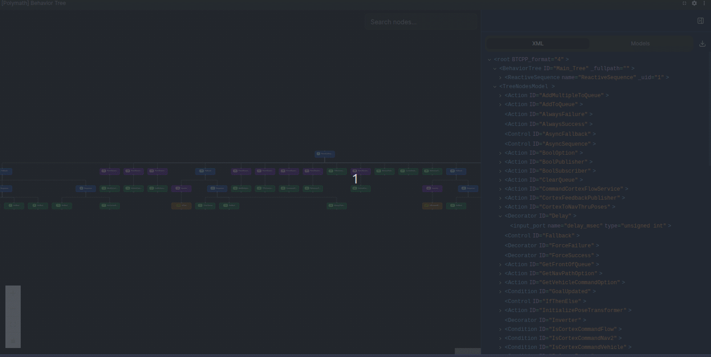

# Behavior Tree Panel



This panel visualizes behavior trees running against BehaviorTree.CPP. For now it just visualizes the representation of the tree, but we also want to build out functionality to support live visualization of state of the behavior tree through the topic datatype `nav2_msgs/msg/BehaviorTreeLog`.

## How to Use

In order to visualize your behavior tree, you'll need to publish a topic of type `std_msgs/msg/String` that is an XML string of your tree. Example:

```cpp
std_msgs::msg::String bt_xml_msg;
bt_xml_msg.data = BT::WriteTreeToXML(tree_, true, true);
```
