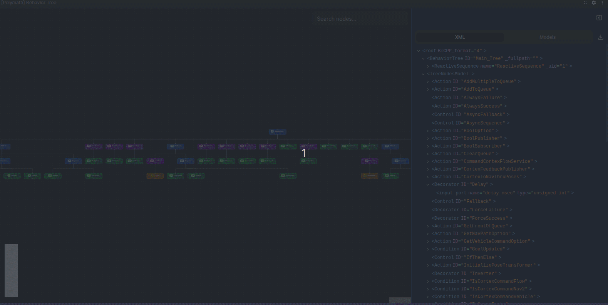

# Behavior Tree Panel



This panel visualizes BehaviorTree.CPP trees and their live node states. The tree is loaded from a
`std_msgs/msg/String` XML topic, and status changes are loaded from a
`nav2_msgs/msg/BehaviorTreeLog` topic.

## How to Use

Publish the instantiated tree as XML:

```cpp
std_msgs::msg::String bt_xml_msg;
bt_xml_msg.data = BT::WriteTreeToXML(tree_, true, true);
```

The first `true` includes BehaviorTree.CPP metadata such as each node's `_uid`. The panel uses that UID
to associate `BehaviorTreeStatusChange.uid` values with graph nodes. Node-name matching is used only as
a fallback for uniquely named nodes.

Publish or record `nav2_msgs/msg/BehaviorTreeLog` messages from the same tree. Nav2's
`RosTopicLogger` publishes these messages on `behavior_tree_log` by default.

In the Foxglove panel settings, select:

1. **Behavior Tree XML Topic** - the `std_msgs/msg/String` topic containing the XML.
2. **Behavior Tree Logs Topic** - the `nav2_msgs/msg/BehaviorTreeLog` topic containing transitions.

Live status colors are:

- Gray: `IDLE`
- Amber and pulsing: `RUNNING`
- Green: `SUCCESS`
- Red: `FAILURE`
- Slate: `SKIPPED`

The panel clears accumulated status when Foxglove seeks, when the selected topics change, or when a
different tree XML document replaces the loaded tree. This prevents state from the prior source or tree
from remaining visible.
